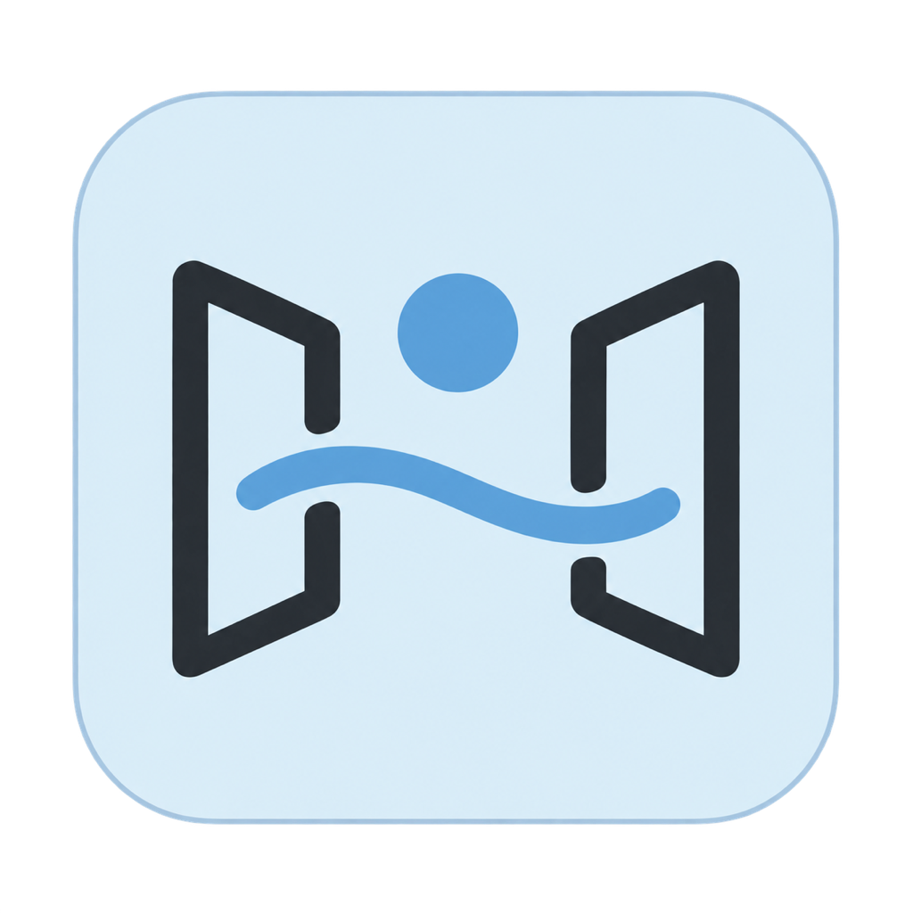

# irudd-scope

A private workspace where coding agents leave things for a human to inspect. An Electron app stores and displays artifacts on the Mac. Local publishing works while Scope is open, without a VM. An optional hub forwards remote requests and fails when the Mac is unavailable. Codex and Claude can publish through the same CLI.

The repository is public. Artifact data and credentials stay private. Remote access belongs on a private tailnet.

SQLite stores artifact contents, metadata, ordinary settings, and workspace preferences. Mac provider credentials live directly in Keychain. The private discovery file holds the CLI publishing token. Artifacts stay on the Mac; publishing requires Scope to be running.

## Development

Install the Vite+ version in the [workspace catalog](pnpm-workspace.yaml), then run:

```sh
vp install --frozen-lockfile
vp run ready
```

The project pins Node and pnpm through Vite+. Linux supports development and testing. macOS is the desktop deployment target.

Scope displays text, Markdown, raster images, static HTML, downloadable files,
and editable Excalidraw diagrams. Diagram generation uses an OpenRouter key
configured in the desktop. Built-in file and diagram plugins run inside a
shared tab host with persistent groups and events limited to each group.
The app runs from a checkout; this repo does not
provide an application installer.

See [development and launch commands](docs/development.md),
[architecture and ownership](docs/architecture.md),
[storage and recovery](docs/storage.md), [protocol](packages/protocol/README.md),
[technology](docs/technology.md), and [UI decisions](ux.md).
[Visual design](docs/visual-design.md) describes the desktop's shared tokens
and controls. Contributor instructions start in [AGENTS.md](AGENTS.md).

MIT licensed.
