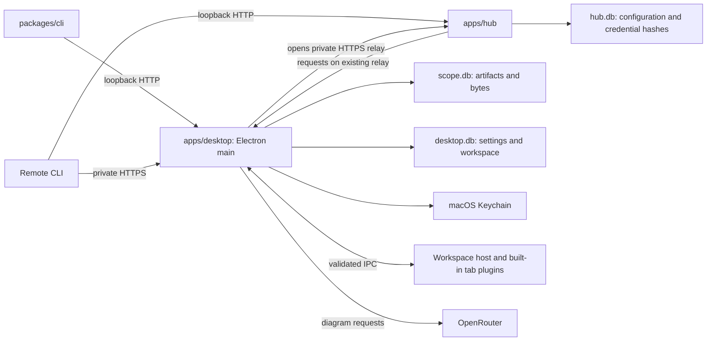

# Architecture

Scope stores artifacts from coding agents and displays them in a Mac desktop
workspace. The desktop owns the library. Publishing requires an awake Mac
running Scope. A failed publication is not queued or replayed.

## Names and ownership

Use the same names in code, documentation, diagrams, issues, and reviews.
Folders name the work they own. Names in saved records, commands, and wire
formats are compatibility contracts.

| Name              | Meaning                                                                                                 | Owner                                                                                                     |
| ----------------- | ------------------------------------------------------------------------------------------------------- | --------------------------------------------------------------------------------------------------------- |
| Artifact          | Latest published metadata and content for one stable ID.                                                | `packages/protocol/src/index.ts` defines the contract; `apps/desktop/src/library/` stores and serves it.  |
| Revision          | Increasing integer for an artifact; writers supply the revision they read.                              | Artifact protocol and desktop artifact store.                                                             |
| Blob              | Immutable bytes identified by SHA-256, stored in SQLite.                                                | `apps/desktop/src/library/store.ts`.                                                                      |
| Source            | Optional publication provenance, such as host, repository, or agent. Unknown values stay absent.        | Protocol contract; `packages/cli` collects available values.                                              |
| Artifact library  | Published artifact metadata and the desktop's connection status.                                        | `apps/desktop/src/library/library.ts`; `library/use-library.ts` tracks unread updates.                    |
| Workspace         | Open and closed tab records, group membership, and selected tab ID. Closing preserves content.          | `apps/desktop/src/workspace/contract.ts` defines the contract; `workspace/use-workspace.ts` manages tabs. |
| Settings          | Appearance, provider configuration, and credential presence.                                            | `apps/desktop/src/settings.ts` defines the contract; `desktop-store.ts` stores preferences.               |
| Semantic scene    | Diagram nodes, text, connections, and groups with stable IDs.                                           | `apps/desktop/src/plugins/diagram/contract.ts` and `scene.ts`.                                            |
| Diagram operation | A validated change to a semantic scene, such as moving a node or adding a connection.                   | `apps/desktop/src/plugins/diagram/contract.ts`; `scene.ts` applies operations.                            |
| Canvas            | The editable Excalidraw document and its view state.                                                    | `apps/desktop/src/plugins/diagram/canvas.ts` converts scenes; `plugins/diagram/view.tsx` owns editing.    |
| Diagram draft     | Unpublished canvas, conversation, prompt, panel state, and view position based on an artifact revision. | `apps/desktop/src/plugins/diagram/draft.ts` defines the contract; `desktop-store.ts` stores drafts.       |
| Diagram provider  | Generates validated diagram operations from an intent and semantic scene.                               | `apps/desktop/src/plugins/diagram/contract.ts`; `openrouter.ts` owns the external API format.             |
| Publishing token  | Bearer credential for the artifact HTTP API. Distinct from a provider API key.                          | Desktop discovery file; CLI and optional hub use it.                                                      |

`packages/protocol` owns shared schemas, wire formats, limits, the discovery
contract, and the HTTP client. It imports no app, filesystem, Electron, or
provider code. [Its README](../packages/protocol/README.md) documents the API.

`apps/desktop` owns persistence, the loopback publishing listener, provider
calls, and the human workspace. Its main process owns database connections,
native APIs, and credentials. `main.ts` starts these resources and closes them
after pending saves finish. `ipc.ts` validates callers and handles the named
operations declared in `bridge.ts` and exposed by `preload.ts`.
`renderer-security.ts` serves the application and restricts renderer access.

`updates.ts` owns the installed app's startup Git check, local build process,
and prepared update. `agent-tools.ts` installs and removes the local CLI and
global publishing skill through named IPC operations. `installation-process.ts`
owns cancellation of their child processes. `installation-files.ts` validates
bundle metadata, replaces the installed app bundle, and manages links to
complete app builds and the Applications location. These files contain
installed program code, not artifact or preference storage. The root
`install.sh` maintains a private clone and calls `tools/package-desktop.ts` to
make a Mac app. No app imports build-tool code at runtime.

`desktop-store.ts` persists settings, workspace preferences, and diagram
drafts. Their contracts live in `settings.ts`, `workspace/contract.ts`, and
`plugins/diagram/draft.ts`, without filesystem or database dependencies. Provider
configuration lives in `plugins/diagram/provider-settings.ts`; provider requests do
not depend on desktop storage.

`library/library.ts` watches publication events, refreshes metadata on
connection, and caches content by revision. The sandboxed React renderer
receives an `ArtifactLibrarySnapshot`. `library/use-library.ts`
tracks unread updates, `workspace/use-workspace.ts` restores and saves tabs,
and `workspace/search.tsx` presents search results. The workspace
component owns layout, dialogs, and shortcuts. `plugins/diagram/` owns semantic scenes
and their conversion to Excalidraw; `plugins/diagram/view.tsx` owns editing.

## Tabs, plugins, and groups

A tab has a UUID, group UUID, plugin type, title, and versioned JSON state.
Groups have their own UUID and an owner reference with a kind and ID. Owners
are independent of tab lifetimes. The current desktop opens publications in
one local workspace group. Group indicators and agent-facing group selection
are not exposed. `source.sessionId` remains publication provenance.

`workspace/` owns navigation, selection, close/reopen, saved records, and event
routing. `workspace/tab-host.tsx` supplies `TabContext` and keeps inactive tabs
mounted. Its error boundary contains a failed view. Unknown plugin types and
unsupported saved state remain stored and display an unavailable view.

Each directory under `plugins/` owns one built-in implementation. `file/`
keeps the existing image, Markdown, HTML, text, and download fallback views
together. `diagram/` owns the editor, creation tool, semantic operations,
canvas conversion, provider calls, and draft contracts. A plugin can render
content without referencing a library item. Publication support and creation
tools are optional registrations. These are trusted modules in one renderer.
Untrusted published HTML retains its separate iframe restrictions.

`plugins/registry.ts` registers process-independent saved-state validators.
`registry.renderer.ts` registers views and tools; `registry.main.ts` registers
main handlers. Main validates callers before invoking those handlers. Plugins
use shared contracts and host operations. Lint rejects imports between plugin
implementations and imports of registries from inside a plugin.

`plugins/events.ts` defines validated domain events. A tab emits through its
context, and the router attaches its tab and group IDs. Other open tabs in
the same group receive matching subscriptions; the sender receives no echo.
Host subscribers can observe all groups. Subscription cleanup and membership
checks prevent delivery to closed tabs. Listener failures do not stop other
listeners. Event payloads are neither persisted nor replayed.

The renderer saves current membership before forwarding an event through
named IPC. Main validates the envelope against saved open tabs before invoking
its `onTabEvent` subscribers. Saving documents and other operations that need
a result use named async operations. Event delivery does not acknowledge a
listener's work. New tabs load current state through library or plugin queries.

## CLI and forwarding

`packages/cli` detects file kinds, gathers inexpensive provenance, and publishes
through the protocol client. It does not read transcripts or launch agents.

`apps/hub` authenticates and forwards requests and event streams. `state.ts`
owns hub configuration, pairing expiry, and credential hashes in `hub.db`.
`paired-server.ts` retains only bounded active requests in memory. It owns no
artifacts, retry queue, or provider credentials. A disconnected desktop
produces a 503 response before headers are sent. A failure during streaming
closes the response.

The Mac's `remotes.ts` opens an authenticated HTTPS event connection to each
enabled hub. When a local CLI request arrives at a hub, the Mac opens the
request-body and response transfers. Every connection starts at the Mac, so
remote hosts need no inbound route to it. Shared relay and pairing contracts
live in `packages/protocol/src/remote.ts`. The Mac only forwards validated
artifact API requests to its own publishing listener.

`packages/cli/src/setup.ts` installs the user service, bundled skill, and a
dedicated Tailscale Serve route. It invokes the installed hub executable to
configure hub-owned state. `install-cli.sh` and `tools/package-cli.ts` install
the standalone CLI with its runtime and hub payload. They do not install the
desktop or operate another machine over SSH.

Dependencies point from each app and CLI toward the protocol. Apps do not
import one another's source. Keep responsibilities together until splitting
them solves a concrete problem. Do not add generic service or adapter layers
just to apply an architectural pattern. Rename callers, tests, and current
docs together when terminology changes.

## Publication and persistence

Opening Scope starts the loopback API and writes its endpoint and bearer token
to a private discovery file. Local CLI calls discover them automatically.
Explicit endpoints require explicit credentials. Remote callers use their
local hub discovery file, or a private HTTPS endpoint with explicit credentials.
Both listeners bind to loopback. Paired hubs have separate local publishing
and desktop connection credentials. One-time pairing exchanges a short-lived
secret for a connection credential stored in Mac Keychain; hub SQLite retains
only its hash. Desktop SQLite stores remote names, endpoints, and enabled state.

The original direct-forwarding hub mode remains available with `SCOPE_ENDPOINT`
and `SCOPE_TOKEN`. It requires the hub to reach the desktop and uses its
publishing token. It does not participate in pairing.

Closing the last window quits Scope and stops publication. The connection
file remains, so its presence does not establish that the desktop is running.
A lost response can leave the caller uncertain whether a write committed.
Read the current artifact before retrying an uncertain update.

The artifact store inserts bytes before publishing their metadata. The
expected-revision check and metadata write share a SQLite transaction.
Competing writes cannot silently overwrite one another. Failed publication
can leave an unused blob row. The API returns only the current revision;
there is no artifact deletion or history browser, and unused bytes remain
in the database.

SSE announces changes. Desktop main lists artifacts on connection and
reconnection, then merges those records with notifications. The database
retains artifacts across missed events and process restarts.

Diagram drafts and workspace preferences live in `desktop.db`. Draft writes
do not publish an artifact revision. Save does. Closing a tab retains its
draft and conversation. On shutdown, main asks the renderer to flush pending
writes before closing SQLite. If flushing fails, the user can keep Scope open
or explicitly quit without those changes.

See [storage and recovery](storage.md) for locations, backup, and supported
imports. Persisted contract changes must preserve existing data or define a
migration before implementation.

## Desktop security and generation

The renderer has no Node integration. Main validates IPC callers and inputs,
blocks unexpected navigation and child windows, and denies permissions.
The preload exposes no arbitrary filesystem, shell, fetch, or secret-reading
operations. Artifact rendering receives content and metadata, not credentials.

HTML runs in an iframe with scripts, same-origin access, forms, popups,
nested frames, and external resources blocked. Markdown omits raw HTML and
replaces links and images with text. Downloads use a save dialog in main.

OpenRouter is the diagram provider, using the model in `plugins/diagram/provider-settings.ts`. The
settings form submits a new key to main and clears the input after saving.
Main stores the key in a profile-specific macOS Keychain entry and returns
only presence or an access error. Linux and isolated development sessions
keep keys in memory. Provider keys never enter SQLite, the hub, or artifact
content.

Create diagram and Ask agent invoke the provider explicitly, one request
at a time, with cancellation. The provider returns validated semantic
operations and usage. The renderer applies those operations to Excalidraw.
Concurrent edits and new artifact revisions retain the working canvas and
offer recovery choices. The HTTP API accepts finished artifacts, not
generation jobs. Scope does not run or coordinate coding sessions.
