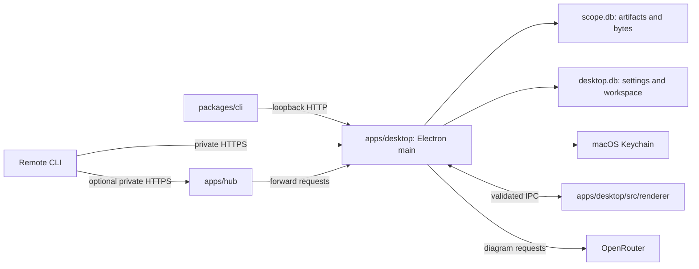

# Architecture

Scope stores artifacts from coding agents and displays them in a Mac desktop
workspace. The desktop owns the library. Publishing requires an awake Mac
running Scope. A failed publication is not queued or replayed.

## Names and ownership

Use the same names in code, documentation, diagrams, issues, and reviews.
Folders name the work they own. Names in saved records, commands, and wire
formats are compatibility contracts.

| Name             | Meaning                                                                                                 | Owner                                                                                                      |
| ---------------- | ------------------------------------------------------------------------------------------------------- | ---------------------------------------------------------------------------------------------------------- |
| Artifact         | Latest published metadata and content for one stable ID.                                                | `packages/protocol/src/index.ts` defines the contract; `apps/desktop/src/artifacts/` stores and serves it. |
| Revision         | Increasing integer for an artifact; writers supply the revision they read.                              | Artifact protocol and desktop artifact store.                                                              |
| Blob             | Immutable bytes identified by SHA-256, stored in SQLite.                                                | `apps/desktop/src/artifacts/store.ts`.                                                                     |
| Source           | Optional publication provenance, such as host, repository, or agent. Unknown values stay absent.        | Protocol contract; `packages/cli` collects available values.                                               |
| Workspace        | Open and closed tabs and the selected artifact. Closing a tab preserves the artifact.                   | `apps/desktop/src/settings.ts` and `renderer/workspace.tsx`.                                               |
| Diagram draft    | Unpublished canvas, conversation, prompt, panel state, and view position based on an artifact revision. | `apps/desktop/src/diagram/draft.ts` and desktop settings storage.                                          |
| Diagram provider | Generates validated drawing operations from an intent and semantic scene.                               | `apps/desktop/src/diagram/contract.ts`; `openrouter.ts` owns the external API format.                      |
| Publishing token | Bearer credential for the artifact HTTP API. Distinct from a provider API key.                          | Desktop discovery file; CLI and optional hub use it.                                                       |

`packages/protocol` owns shared schemas, wire formats, limits, the discovery
contract, and the HTTP client. It imports no app, filesystem, Electron, or
provider code. [Its README](../packages/protocol/README.md) documents the API.

`apps/desktop` owns persistence, the loopback publishing listener, provider
calls, and the human workspace. Main owns database connections, native APIs,
and credentials. The preload exposes named operations to the sandboxed React
renderer. `diagram/` owns semantic scenes and their conversion to Excalidraw;
`renderer/` owns the visible controls and editing flow.

`packages/cli` detects file kinds, gathers inexpensive provenance, and publishes
through the protocol client. It does not read transcripts or launch agents.

`apps/hub` authenticates and forwards requests and event streams. It owns no
database, content directory, queue, or provider credentials. An unreachable
desktop produces a 503 response before response headers are sent. A failure
during streaming closes the response.

Dependencies point from each app and CLI toward the protocol. Apps do not
import one another's source. Keep responsibilities together until splitting
them solves a concrete problem. Do not add generic service or adapter layers
just to apply an architectural pattern. Rename callers, tests, and current
docs together when terminology changes.

## Publication and persistence

Opening Scope starts the loopback API and writes its endpoint and bearer token
to a private discovery file. Local CLI calls discover them automatically.
Explicit endpoints require explicit credentials. Remote callers use private
HTTPS to reach the desktop directly or through the hub. Both listeners bind
to loopback and require the desktop publishing token for artifact requests.

Closing the last window quits Scope and stops publication. The connection
file remains, so its presence does not establish that the desktop is running.
A lost response can leave the caller uncertain whether a write committed.
Read the current artifact before retrying an uncertain update.

The artifact store inserts bytes before publishing their metadata. The
expected-revision check and metadata write share a SQLite transaction.
Competing writes cannot silently overwrite one another. Failed publication
can leave an unused blob row. The API returns only the current revision;
there is no artifact deletion or history browser, and unused bytes remain
in the database.

SSE announces changes. Desktop main lists artifacts on connection and
reconnection, then merges those records with notifications. The database
retains artifacts across missed events and process restarts.

Diagram drafts and workspace preferences live in `desktop.db`. Draft writes
do not publish an artifact revision. Save does. Closing a tab retains its
draft and conversation. On shutdown, main asks the renderer to flush pending
writes before closing SQLite. If flushing fails, the user can keep Scope open
or explicitly quit without those changes.

See [storage and recovery](storage.md) for locations, backup, and supported
imports. Persisted contract changes must preserve existing data or define a
migration before implementation.

## Desktop security and generation

The renderer has no Node integration. Main validates IPC callers and inputs,
blocks unexpected navigation and child windows, and denies permissions.
The preload exposes no arbitrary filesystem, shell, fetch, or secret-reading
operations. Artifact rendering receives content and metadata, not credentials.

HTML runs in an iframe with scripts, same-origin access, forms, popups,
nested frames, and external resources blocked. Markdown omits raw HTML and
replaces links and images with text. Downloads use a save dialog in main.

OpenRouter is the diagram provider, using the model in `settings.ts`. The
settings form submits a new key to main and clears the input after saving.
Main stores the key in a profile-specific macOS Keychain entry and returns
only presence or an access error. Linux and isolated development sessions
keep keys in memory. Provider keys never enter SQLite, the hub, or artifact
content.

Create diagram and Ask agent invoke the provider explicitly, one request
at a time, with cancellation. The provider returns validated semantic
operations and usage. The renderer applies those operations to Excalidraw.
Concurrent edits and new artifact revisions retain the working canvas and
offer recovery choices. The HTTP API accepts finished artifacts, not
generation jobs. Scope does not run or coordinate coding sessions.
