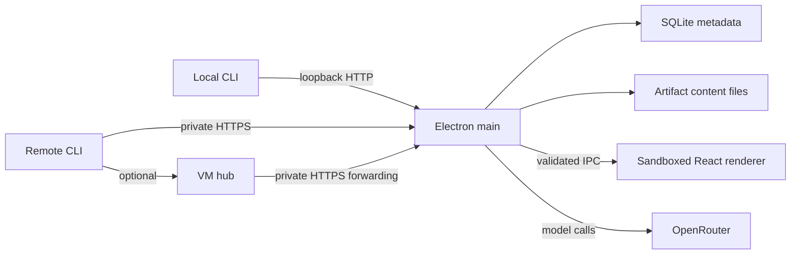

# Architecture

Scope stores artifacts from coding agents and shows them to a human. The Mac desktop owns the artifact library. Publishing requires the Mac to be awake and Scope to be running. Unavailable desktops return an error. Publication is not queued, retried automatically, or replayed later.

## Ownership

`packages/protocol` owns artifact types, input validation, wire formats, limits, the local connection-file contract, and the shared HTTP client. It has no dependency on an application, filesystem, Electron, or model provider. Its README defines the public exchanges beside those contracts.

`apps/desktop` owns durable artifact metadata, revisions, content files, the publishing API, the human workspace, local preferences, credentials, and model execution. Electron main opens SQLite and the loopback HTTP listener, and closes them when the app quits. The sandboxed React renderer uses a small preload API. Artifact renderers receive artifact data, never publishing tokens or provider credentials.

`packages/cli` owns file detection, explicit publication, and cheap optional provenance from hostname, cwd, Git, and supplied agent/session information. It discovers the local desktop through a private connection file and uses the protocol client. An explicit endpoint requires explicit credentials. The CLI does not inspect transcripts or launch agents.

`apps/hub` is an optional forwarding service. It authenticates requests and streams them to the configured desktop endpoint. It owns no artifact database or content files. If the desktop cannot be reached, the hub returns 503. It never receives an OpenRouter API key. Durable remote buffering and replay are future work.

Dependencies point from each app and CLI to `packages/protocol`. No app imports another app's internal source. Artifact storage stays in desktop, its only owner. Provider and renderer code also stays in desktop until a second real consumer justifies moving it.

## Local and remote publication

Opening Scope starts its publishing API on loopback and writes the endpoint and a generated bearer token to a connection file readable only by the current user. The CLI reads this file for local use. The token remains stable across app restarts. Local use requires no VM, tailnet, or connection form.

Remote callers use private HTTPS to reach the Mac, normally through Tailscale Serve. They may publish directly or through the optional hub. Both paths require the desktop's publishing token. The desktop and hub bind only to loopback; neither belongs on a public listener or funnel.

Closing the last window quits Scope and stops publication. The connection file remains available for the next launch, but it does not represent a running app. A connection failure produces an error and no background retry. A lost response may leave the caller uncertain whether a write committed; read the current artifact before retrying.

## Persistent data

The desktop is authoritative for artifact content and metadata. SQLite and content files live in one local data directory. An artifact has a stable ID and an increasing revision. Create refuses an existing ID. Update requires the expected revision, so two writers cannot silently overwrite one another. Closing a desktop tab only changes local workspace preferences.

Content files use SHA-256 names and are installed before SQLite references them. A failed metadata write can leave an unused blob, but never a row pointing at unfinished content. Metadata updates are atomic. The current artifact revision has no history browser. Future migrations must preserve IDs and existing records.

Optional provenance fields are absent when unknown. Missing information must not prevent publication. Session records and hook installation are not prerequisites for artifact records.

SSE announces changes. Clients reconcile the current artifact list on connection and reconnection. Stored artifacts survive a missed event and a desktop restart. The stream is a notification channel, not the durable archive.

## Desktop security and providers

Agent HTML is untrusted. Preview it in a sandboxed iframe with no scripts, same-origin permission, forms, popups, parent access, or external network access. Do not load it as a privileged Electron page. Downloads use an explicit save dialog in main.

The preload API exposes named operations and validates IPC callers. It must not expose arbitrary filesystem access, shell execution, fetch, Electron objects, or secret-reading methods. The app blocks unexpected navigation, child windows, and permissions.

Settings initially offers OpenRouter and `google/gemini-3.8-flash`. The trusted settings form can submit a new key once. Main encrypts it with Electron asynchronous `safeStorage`, clears the submitted value from the form, and returns only whether a key is stored. On macOS, Keychain protects the encryption key; the API key's ciphertext stays in the app's local data directory. Replacing and removing the key are supported. Stable code signing is needed for consistent Keychain access across Mac builds.

Linux development must not persist a key through Electron's insecure fallback. A key may be used in memory for that process. Standard tests use synthetic responses and never need a real key. The local publishing token is also kept out of artifact renderers.

Diagram generation accepts intent and a compact semantic scene and returns validated semantic drawing operations plus usage. `apps/desktop/src/diagram/contract.ts` owns `DiagramProvider`; `openrouter.ts` owns OpenRouter's wire format. The renderer translates validated operations into Excalidraw elements. Future local Codex and Claude CLI providers implement that same narrow task contract inside desktop main. They must not become a generic execution API. Provider choice is not part of the artifact transport.

The Create diagram tool and an existing diagram's change field invoke this provider. Generation is explicit, with one request at a time and a cancel action. The desktop does not accept remote generation jobs. Agents can publish a finished `.excalidraw` file immediately; a CLI command that delegates generation to the open Mac app is later work.

## Delivery boundaries

The current implementation supports text/Markdown, image, static HTML, file, and Excalidraw publication through CLI and desktop, including stable updates, SSE, persistence, and provider settings. The optional hub forwards the same API. Editable Excalidraw and the explicit diagram tool use validated semantic operations and a canvas adapter. Optional provider-neutral observation of tool-call sizes and session analysis are planned. Retain raw provider details where normalization would lose information.

No MCP, agent orchestration, remote commands, accounts, public ingestion, collaboration server, transcript archive, or plugin system is needed for this implementation. The visual design is described separately in the prototype brief.
