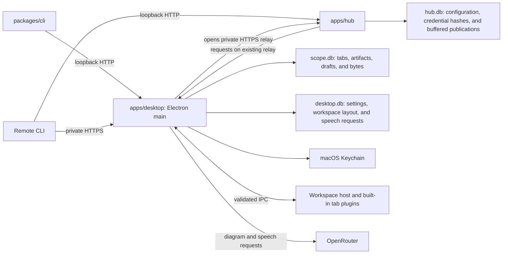
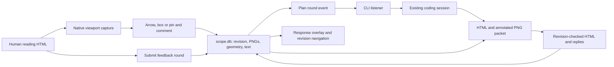

# Architecture

Scope stores artifacts from coding agents and displays them in a Mac desktop
workspace. The desktop owns the library. Direct publication requires an awake
Mac running Scope. Paired hubs temporarily store CLI publications before
attempting delivery while the Mac is connected.



Speech generation lives in `apps/desktop/src/voice/`. Desktop main submits
OpenRouter requests using the shared credential store, persists request receipts
and audio in `desktop.db`, and serves short authenticated submission, status,
cancellation, billing-refresh, and download requests through the library HTTP
server. `packages/protocol/src/voice.ts` owns the public contracts; the CLI owns
explicit audio and receipt exports. The hub forwards the same routes without
provider calls or speech storage. Speech results are independent of tabs.

## HTML plans

`packages/protocol/src/plan.ts` defines review commands, revisions, comments,
normalized annotation geometry, feedback rounds, responses and bounds. A plan
is a named `plan` artifact with `text/html` content. The HTML authoring contract
is unchanged. The library enforces immutable names and kinds, and sets a new
plan's tab permanent only at initial publication.

`library/plan-store.ts` owns tab-bound history and feedback in `scope.db`, using
the artifact store's SQL runtime and serialized mutation queue. HTML revisions
and PNGs reuse content-addressed blobs. Comments retain both original and marked
PNGs with their originating revision. Writes carry UUID request IDs; a matching
retry returns a compact receipt without applying the mutation twice. Changed
payloads under the same ID conflict. Responses that change HTML check the
current revision and commit HTML, per-comment replies and round status together.
Answers without HTML may refer to a retained older revision.

`library/plan-read.ts` loads bounded metadata pages using revision and record
cursors. It queries document byte lengths before fetching JSON. Each page has
at most 100 revisions and 100 records and stays below the 16 MiB reply bound.
A cursor checks the review version in the same read transaction; changes
require restarting the read. Round exports select only that round and its
comments and responses. Listeners select only pending rounds. Shared protocol
`readPlanSnapshot` combines pages and retries a changed-version read.

`plugins/plan/main.ts` registers validated draft, review and native screenshot
IPC. Capture checks the selected active named plan and window bounds before and
after Electron captures its viewport. `plugins/plan/view.tsx` retains the live
HTML iframe independently of review state. `annotation.tsx` overlays normalized
marks on a frozen capture and rasterizes a marked PNG; `review.tsx` displays the
feedback queue, responses and history. Explicit revision navigation replaces
the iframe content. Incoming metadata and feedback leave it in place. Reconnected event streams
refresh durable review state even when the HTML revision did not change.

`library/plan-http.ts` serves authenticated review commands, retained HTML and
plan-owned images. Hubs forward those routes but store no review data. Review
commands require the desktop online. Initial publications use the existing
hub publication queue.

The CLI's `plan.ts` exports HTML and a visual feedback packet to explicit files,
validates response files and submits replies. `plan-watch.ts` recovers pending
rounds and listens for new submissions. `agent-notifications.ts` contains shared
T3, Codex and Claude adapters used by both diagram and plan listeners. Listeners
notify an existing session and hold no model turn open. A durable round is the
source of truth; SSE and host notices can repeat or be missed during disconnect.
Scope does not orchestrate agent execution.



## Pull request inboxes

A pull request inbox is a permanent named `pull-requests` HTML artifact bound
to one GitHub repository. `packages/protocol/src/pull-requests.ts` owns its
validated commands and snapshots. `library/pull-request-store.ts` owns the
repository binding, current open PR facts, local notes and snoozes, review
baselines, and current agent assessments in `scope.db`. These records belong
to the tab UUID. Publishing another HTML revision preserves them.

`plugins/pull-requests/gh-process.ts` runs the installed `gh` executable without
a shell, using the desktop user's existing login. `gh.ts` reads GitHub facts
and on-demand details. `sync.ts` owns one adaptive polling scheduler and shares
repository reads across inboxes using the same desktop account. It cancels work
on suspension, tab removal, and shutdown. A complete inventory commits
in one transaction and removes PRs no longer open. Failed or incomplete reads
preserve the previous inventory. Local and agent records have separate version
checks and do not get replaced by GitHub facts.

First load commits a complete lightweight inventory before enriching checks,
mergeability, and conversations in bounded batches. Checks, mergeability, and conversations are Unknown and sync remains
in progress until enrichment finishes. An enrichment failure retains that valid
base list. Once a base inventory has been committed, retries and later refreshes
read and commit enriched facts together, preserving cached facts on failure.
This remains true after restart; an incomplete membership read never replaces the list.

`plugins/pull-requests/view.tsx` hosts trusted authored HTML and injects
`window.scope.pullRequests` before its scripts run. The HTML receives immutable
arrays and issues validated operations through the host, rather than accessing
SQLite or credentials. The host subscribes before its first snapshot read and
reloads durable state after invalidation or reconnect. Refreshing PR state
preserves the iframe; publishing a new HTML revision replaces it after pending
local edits finish saving. Transient notices carry no replay history.

Configured inboxes refresh automatically while Scope is running and awake.
Selection, wake, and reconnect request coalesced fresh reads; Sync remains a
fallback. Foreground, background, and inspected-PR reads use different target
intervals, lengthened to fit observed GitHub cost and remaining quota. The
500-point hourly account target controls admission of new automatic jobs;
admitted jobs finish. Manual Sync and detail reads bypass that routine wait,
while every request respects actual quota reserve and throttling. Main owns
the timers; renderer interests identify the visible inbox and inspected PR.
An inspected PR's reviews refresh without downloading its captured diff again.
Native creation publishes the built-in flat-list app;
agents can publish their own HTML with named JavaScript views. GitHub access is
read-only. Review submission and merges remain on GitHub. Authenticated HTTP
commands work without the tab being mounted. Paired hubs forward them and keep
no PR state.

## Names and ownership

Use the same names in code, documentation, diagrams, issues, and reviews.
Folders name the work they own. Names in saved records, commands, and wire
formats are compatibility contracts.

| Name                 | Meaning                                                                                             | Owner                                                                                                     |
| -------------------- | --------------------------------------------------------------------------------------------------- | --------------------------------------------------------------------------------------------------------- |
| Artifact             | Latest published metadata and content for one stable ID.                                            | `packages/protocol/src/index.ts` defines the contract; `apps/desktop/src/library/` stores and serves it.  |
| Revision             | Increasing integer for an artifact; writers supply the revision they read.                          | Artifact protocol and desktop artifact store.                                                             |
| Tab name             | Optional second unique key, preserved across revisions and sessions.                                | Artifact protocol; desktop artifact store enforces uniqueness.                                            |
| Diagram version      | Digest of the tab UUID and native canvas content, used for optimistic edits.                        | `packages/protocol/src/diagram-sync.ts`; desktop diagram editor.                                          |
| Diagram working file | Explicit agent export with a native document, compact base, and version.                            | `packages/cli/src/diagram-working.ts`; disposable with the worktree.                                      |
| Blob                 | Immutable bytes identified by SHA-256, stored in SQLite.                                            | `apps/desktop/src/library/store.ts`.                                                                      |
| Source               | Optional publication provenance, such as host, repository, or agent. Unknown values stay absent.    | Protocol contract; `packages/cli` collects available values.                                              |
| Artifact library     | Published artifact metadata and the desktop's connection status.                                    | `apps/desktop/src/library/library.ts`; `library/use-library.ts` tracks unread updates.                    |
| Workspace            | Active, queued, and trashed tab records, retention timestamps, groups, and selection.               | `apps/desktop/src/workspace/contract.ts` defines the contract; `workspace/use-workspace.ts` manages tabs. |
| Settings             | Appearance, provider configuration, and credential presence.                                        | `apps/desktop/src/settings.ts` defines the contract; `desktop-store.ts` stores preferences.               |
| Semantic scene       | Diagram nodes, text, connections, and groups with stable IDs.                                       | `packages/protocol/src/diagram.ts`; desktop `scene.ts` validates relationships.                           |
| Diagram operation    | A validated change to a semantic scene, such as moving a node or adding a connection.               | `packages/protocol/src/diagram.ts`; desktop `scene.ts` applies operations.                                |
| Canvas               | The editable Excalidraw document and its view state.                                                | `apps/desktop/src/plugins/diagram/canvas.ts` converts scenes; `plugins/diagram/view.tsx` owns editing.    |
| Diagram draft        | Working canvas, conversation, prompt, panel state, and view position based on an artifact revision. | `apps/desktop/src/plugins/diagram/draft.ts` defines the contract; `library/store.ts` stores drafts.       |
| Diagram provider     | Generates validated diagram operations from an intent and semantic scene.                           | `apps/desktop/src/plugins/diagram/contract.ts`; `openrouter.ts` owns the external API format.             |
| Publishing token     | Bearer credential for the artifact HTTP API. Distinct from a provider API key.                      | Desktop discovery file; CLI and optional hub use it.                                                      |

`packages/protocol` owns shared schemas, wire formats, limits, the discovery
contract, and the HTTP client. It imports no app, filesystem, Electron, or
provider code. [Its README](../packages/protocol/README.md) documents the API.

`apps/desktop` owns persistence, the loopback publishing listener, provider
calls, and the human workspace. Its main process owns database connections,
native APIs, and credentials. `main.ts` starts these resources and closes them
after pending saves finish. `ipc.ts` validates callers and handles the named
operations declared in `bridge.ts` and exposed by `preload.ts`.
`renderer-content.ts` serves the application's renderer files.

`updates.ts` owns the installed app's startup Git check, local build process,
prepared update, and certificate changes that take effect on restart.
`signing.ts` resolves certificate names to fingerprints through macOS Keychain
and opens Keychain Access for setup. `agent-tools.ts` installs and removes the local CLI and
global publishing skill through named IPC operations. `installation-process.ts`
owns cancellation of their child processes. `installation-files.ts` validates
bundle metadata, replaces the installed app bundle, and manages links to
complete app builds and the Applications location. These files contain
installed program code, not artifact or preference storage. The root
`install.sh` maintains a private clone and calls `tools/package-desktop.ts` to
make a Mac app. An optional signing certificate fingerprint is recorded in
the bundle's installation metadata and reused for updates. Build directories
distinguish commits and signing identities; signing private keys stay in
Keychain. No app imports build-tool code at runtime.

`credentials.ts` owns desktop credential access. Certificate-signed installations
use `credential-helper.ts` to launch the native `Scope Credentials` executable
in `Contents/Helpers`, implemented in `apps/desktop/native/credentials.m`.
The helper accepts bounded read, write, and delete requests through private
pipes, checks the parent's Scope identifier and matching signing certificate,
and exits after one operation. It accesses the existing profile-specific
Keychain entry. Secrets return only to desktop main and never enter process
arguments or logs. Ad-hoc installations and Mac checkout launches use the
native Keychain module directly; isolated sessions use memory.

`tools/package-credential-helper.ts` builds and signs the helper separately.
Packaging reuses the active build's verified helper when its source, build
options, architecture, and certificate match. The enclosing app signs a
reference to that unchanged executable. This preserves the helper's build
hash, which macOS uses for self-signed Keychain access, across ordinary updates.

`desktop-store.ts` persists settings, workspace groups, and selection.
`library/store.ts` persists tabs, artifact metadata, content references, bytes,
and diagram drafts in `scope.db`. `lifecycle.ts` coordinates opening, closing,
retention, and legacy imports. A saved tab owns its content and draft through foreign
keys. Trash preserves those rows; permanent deletion removes them in one SQLite
transaction. Their contracts live in `settings.ts`, `workspace/contract.ts`,
`workspace/retention.ts`, and
`plugins/diagram/draft.ts`, without filesystem or database dependencies. Provider
configuration lives in `plugins/diagram/provider-settings.ts`; provider requests do
not depend on desktop storage.

`library/library.ts` watches publication events, refreshes metadata on
connection, and caches content by revision. The sandboxed React renderer
receives an `ArtifactLibrarySnapshot`. `library/use-library.ts`
tracks unread updates, `workspace/use-workspace.ts` restores and saves tabs,
and `workspace/search.tsx` presents search results. The workspace
component owns layout, dialogs, and shortcuts. `plugins/diagram/` owns semantic scenes
and their conversion to Excalidraw; `plugins/diagram/view.tsx` owns editing.

## Tabs, plugins, and groups

A tab has a UUID, group UUID, plugin type, title, and versioned JSON state.
Optional validated overlay positions belong to the desktop tab contract and
use the existing SQLite tab record. Old records without positions use the
controls' default locations.
Groups have their own UUID and an owner reference with a kind and ID. Owners
are independent of tab lifetimes. The current desktop opens publications in
one local workspace group. Group indicators and agent-facing group selection
are not exposed. `source.sessionId` remains publication provenance.

`workspace/` owns navigation, selection, closing, saved records, and event
routing. `workspace/tab-host.tsx` supplies `TabContext`. File views load on first
selection and remain mounted across tab switches. Diagram views mount immediately
to receive editing commands. The error boundary in `tab-host.tsx` contains a
failed view. Unknown plugin types and unsupported saved state remain stored and
display an unavailable view.

Each directory under `plugins/` owns one built-in implementation. `file/`
keeps the existing image, Markdown, HTML, text, and download fallback views
together. `diagram/` owns the editor, creation tool, semantic operations,
canvas conversion, provider calls, and draft contracts. A plugin can render
content without referencing a library item. Publication support and creation
tools are optional registrations. These are trusted modules in one renderer.
Published HTML is trusted agent output and runs in an iframe without added restrictions.

`plugins/registry.ts` registers process-independent saved-state validators.
`registry.renderer.ts` registers views and tools; `registry.main.ts` registers
main handlers. Main validates callers before invoking those handlers. Plugins
use shared contracts and host operations. Lint rejects imports between plugin
implementations and imports of registries from inside a plugin.

`plugins/events.ts` defines validated domain events. A tab emits through its
context, and the router attaches its tab and group IDs. Other open tabs in
the same group receive matching subscriptions; the sender receives no echo.
Host subscribers can observe all groups. Subscription cleanup and membership
checks prevent delivery to closed tabs. Listener failures do not stop other
listeners. Event payloads are neither persisted nor replayed.

The renderer saves current membership before forwarding an event through
named IPC. Main validates the envelope against saved open tabs before invoking
its `onTabEvent` subscribers. Saving documents and other operations that need
a result use named async operations. Event delivery does not acknowledge a
listener's work. New tabs load current state through library or plugin queries.

## CLI and forwarding

`packages/cli` detects file kinds, gathers inexpensive provenance, and publishes
through the protocol client. It does not read transcripts or launch agents.

`apps/hub` authenticates and forwards requests and event streams. `state.ts`
owns hub configuration, pairing expiry, and credential hashes in `hub.db`.
`paired-server.ts` owns live relay transfers and always stores opted-in
publications through the same tab-first protocol. `publication-queue.ts`
stores their metadata and bytes in `hub.db`, capped at 50 tabs with a fixed
48-hour expiry. `publication-delivery.ts` delivers complete entries through
the existing Mac-initiated relay while connected and retains conflicts for inspection.
Transient delivery failures use a bounded exponential cooldown. Desktop
`remotes.ts` reconnects enabled remotes on the Electron resume event, sending
a one-time authenticated wake header that resets the hub cooldown. Ordinary
reconnects respect it. Retry timing is temporary process state; queued content
remains in SQLite.
`artifact-metadata.ts` retains up to 1,000 recently observed artifact records
in hub SQLite for 48 hours. Opted-in update reads can use their saved IDs,
names, titles, and revisions while offline. Delivery checks the saved revision
against the desktop before writing. Unpairing clears both metadata and queued content.
The hub has no provider credentials. Other offline requests return 503;
a failure during a live stream closes the response.

The Mac's `remotes.ts` opens an authenticated HTTPS event connection to each
enabled hub. When a local CLI request arrives at a hub, the Mac opens the
request-body and response transfers. Every connection starts at the Mac, so
remote hosts need no inbound route to it. Shared relay and pairing contracts
live in `packages/protocol/src/remote.ts`. The Mac only forwards validated
artifact API requests to its own publishing listener.

`packages/cli/src/setup.ts` installs the user service, bundled skill, and a
dedicated Tailscale Serve route. It invokes the installed hub executable to
configure hub-owned state. `install-cli.sh` and `tools/package-cli.ts` install
the standalone CLI with its runtime and hub payload. They do not install the
desktop or operate another machine over SSH.
`packages/cli/src/skill.ts` owns standalone skill links, installed-content
validation, and repair. The hub invokes the installed CLI's `skill check` and
`skill sync` commands rather than importing CLI internals.

The installed Mac's `remote-updates.ts` requests the running app's exact commit
through an authenticated hub update endpoint after connection. It never uses a
prepared desktop build. The hub's `updates.ts` owns update requests and status
in `hub.db`. Its `update-runner.ts` runs in a separate systemd user service,
builds the requested commit, activates the remote tools together, and checks
the restarted hub. It restores the previous build after a failed restart.
Only commits on the fixed repository's `main` history that descend from the
installed remote commit are eligible. Remote update status is independent of
artifact forwarding and buffered delivery.

The update endpoint is additive. Older hubs keep forwarding and report a
missing endpoint, which the Mac explains as requiring a manual installation
update. Mac versions must continue to work with the previous remote protocol
while remotes build or remain offline. Persisted update status adds a settings
entry without changing existing hub configuration or credential fields.

Dependencies point from each app and CLI toward the protocol. Apps do not
import one another's source. Keep responsibilities together until splitting
them solves a concrete problem. Do not add generic service or adapter layers
just to apply an architectural pattern. Rename callers, tests, and current
docs together when terminology changes.

## Publication and persistence

Opening Scope starts the loopback API and writes its endpoint and bearer token
to a private discovery file. Local CLI calls discover them automatically.
Explicit endpoints require explicit credentials. Remote callers use their
local hub discovery file, or a private HTTPS endpoint with explicit credentials.
Both listeners bind to loopback. Paired hubs have separate local publishing
and desktop connection credentials. One-time pairing exchanges a short-lived
secret for a connection credential stored in Mac Keychain; hub SQLite retains
only its hash. Desktop SQLite stores remote names, endpoints, and enabled state.

The original direct-forwarding hub mode remains available with `SCOPE_ENDPOINT`
and `SCOPE_TOKEN`. It requires the hub to reach the desktop and uses its
publishing token. It does not participate in pairing.

Closing the last window quits Scope and stops publication. The connection
file remains, so its presence does not establish that the desktop is running.
A lost response can leave the caller uncertain whether a write committed.
Read the current artifact before retrying an uncertain update.

Publication first commits a queued tab. Content uploads reference that tab;
metadata publication requires both the tab and its uploaded content. Shared
bytes have a reference for each owning tab. The revision check and metadata
write share a SQLite transaction. A small revision counter prevents an old
update from matching an artifact recreated under the same ID.

Closing a permanent tab reorders it to the end of the saved workspace and
selects another tab when available. Closing a temporary tab or explicitly
moving either kind to Trashcan sets its trash timestamp while retaining its content references,
metadata, name, and draft. The desktop lifecycle coordinates retention changes
and notifies the renderer, which removes trashed tabs from its workspace.
The renderer reports visible strip tabs, or the selected fullscreen tab, and
flushes pending writes before requesting cleanup. Main validates each request
and uses its own clock. Temporary tabs outside the strip for 24 hours enter
Trashcan; permanent tabs skip that step. Seven days in Trashcan or explicit
emptying deletes the records. Restore retains the UUID and permanence, resets
visibility time, and appends the tab to the strip.

Permanent deletion cascades through metadata, content references, and drafts.
Shared bytes survive until their last tab reference disappears. The CLI/API
delete command retains this immediate deletion behavior. Empty-trash requests
include tab IDs and trash timestamps so an old confirmation cannot delete a
restored tab. Trashed names remain reserved and publications reject writes to
trashed tabs. Publication list and read APIs still include retained artifacts;
the renderer excludes trash from arrivals and ordinary search. Queued uploads
expire after fifteen minutes without publication. Successful publications open
automatically without a fixed tab count limit. Startup and maintenance reclaim
expired staging references.

The store serializes publication and deletion commits with their SSE notifications,
so a delayed close response cannot announce a deletion after explicit recreation.
Desktop main replaces its list on
reconnection and applies events received during the refresh. Deleted content
leaves the cache and cancels pending loads. Saving a tab or draft updates an
existing tab only, so a late callback cannot recreate a deleted tab. Opening a
publication checks its revision in the same transaction that opens its tab;
an obsolete request cannot open a replacement published under the same ID.

On shutdown, main asks the renderer to flush pending writes for tabs left open.
If flushing fails, the user can keep Scope open or explicitly quit without
those changes. Workspace layout remains in `desktop.db`; tab records and drafts
remain in `scope.db`.

`packages/sqlite` runs SQLite shrinking in a separate process and schedules it
for each database independently. Desktop and hub use it with the shared
maintenance contracts in `packages/protocol`. It owns no application records.
Manual desktop shrinking covers both desktop databases; hub management shrinks
only its local `hub.db`. [Storage](storage.md) defines the interval, threshold,
staging expiry, and recovery limits.

See [storage and recovery](storage.md) for locations, backup, and supported
imports. Persisted contract changes must preserve existing data or define a
migration before implementation.

## Desktop security and generation

The renderer has no Node integration. Main validates IPC callers and inputs.
The preload exposes no arbitrary filesystem, shell, fetch, or secret-reading
operations. Artifact rendering receives content and metadata, not credentials.

HTML runs unchanged in an iframe with scripts, forms, popups, nested frames,
and external resources enabled. Scope adds no iframe sandbox, content security
policy, network filter, or permission denial. The document shares the workspace
origin and can access its parent. Chromium's normal web rules, including CORS,
still apply. Desktop main's `external-links.ts` redirects HTTP(S) document
navigation and popups to the default browser, preserving the artifact in Scope.
It leaves embedded frame loading, embedded form results, downloads, and in-page
anchors in the document. PR inbox handlers run first to retain their validated
link operations and error reporting. Markdown omits raw HTML and replaces links
and images with text.
Artifact downloads use a save dialog in main.

OpenRouter is the diagram provider, using the model in `plugins/diagram/provider-settings.ts`. The
settings form submits a new key to main and clears the input after saving.
Main stores the key through its credential store in a profile-specific macOS Keychain entry and returns
only presence or an access error. Linux and isolated development sessions
keep keys in memory. Provider keys never enter SQLite, the hub, or artifact
content.

Diagram generation requires an explicit opt-in stored with desktop settings.
Profiles without that preference default to off. Ordinary settings reads and
writes do not access provider credentials. The shared OpenRouter settings section
checks key presence through a named desktop IPC operation regardless of feature
switches. Generation reads the key just before calling OpenRouter and checks its
own feature switch in main. Saving and removing the shared key do not require
either feature to be enabled. Voice generation has an independent opt-in and
uses the same credential store.

Create diagram and the Scope diagram agent recipient invoke the provider explicitly, one request
at a time, with cancellation. The provider returns validated semantic
operations and usage. The renderer applies those operations to Excalidraw.
The diagram editor automatically saves canvas changes through the existing
revision-checked publication API. It writes the draft first so a failed
publication retains the working canvas. Conversation and viewport changes do
not publish new artifact revisions.
Concurrent edits and new artifact revisions retain the working canvas and
offer recovery choices. The HTTP API accepts finished artifacts and semantic diagram operations. It
also accepts narrow speech-generation requests. It does not expose arbitrary
provider requests. Scope does not run or coordinate coding sessions.

### Diagram authoring

The shared protocol defines semantic diagram operations and named commands.
The desktop diagram plugin validates relationships, converts native elements,
and handles loaded tab drafts. Authenticated `POST /v1/diagrams` calls use named
main-to-renderer IPC with a deadline. Creating a diagram publishes through the
existing artifact API. Applying operations saves the draft and automatically publishes canvas changes,
while retaining edits if publication fails or an incoming revision conflicts.
The CLI owns file input and explicit PNG output. The hub only forwards requests.
Embedded generation receives bounded recent conversation, current selection,
and read-only object summaries as well as the editable scene. Supported imported
and manually drawn objects use stable native aliases in semantic operations.

### Coding session notifications

Codex, Claude Code, or the enclosing host owns the coding session, its tools,
and its lifetime. Scope's desktop and hub do not launch those processes or
retain their transcripts. A named diagram identifies the document; the listener's
explicit host and thread arguments select the session. Publication provenance
such as `source.sessionId` does not establish a connection.

```text
Human edits, sends a message, or decides a proposal
  |
  v
Scope editor (renderer)
  | scope:diagram-event IPC
  v
Scope desktop main -- GET /v1/events (SSE) -- [optional paired hub]
  |                                                        |
  +-------------------- direct or relayed ------------------+
                              |
                              v
               irudd-scope diagram watch NAME
               filter by artifact; coalesce for 800 ms
               host: messages and proposal decisions
               --watch-edits also sends canvas edits
                              |
             +----------------+------------------+
             |                |                  |
       --codex-thread    --claude-channel     --t3-thread
             |                |                  |
       WebSocket RPC     MCP over stdio     authenticated HTTP
             |                |                  |
       Codex App Server  Claude Code host   T3 orchestration
       thread/read       notification:      thread.turn.start
       idle: turn/start  claude/channel     (host owns queue)
       busy: turn/steer       |                  |
             |                |                  v
             +----------------+----------> existing agent session
```

The adapters live in `packages/cli/src/diagram-watch.ts`. The Codex listener
connects to the App Server that owns the existing thread, initializes its RPC
connection, and reads that thread before delivering notices. For an active turn
it supplies the expected turn ID when steering. An unrelated App Server cannot
reach a terminal session owned by another process. T3 sessions use the T3
adapter and T3 thread ID, rather than the provider's Codex thread ID.
The T3 adapter uses its host environment defaults or an explicit endpoint. It
allows HTTP to loopback and numeric addresses assigned to the same machine;
other machines require HTTPS. The host or a service manager owns the listener
process so it can outlive the tool call that launches it.

For Claude, the direction of process ownership is reversed: Claude starts the
configured Scope CLI as a stdio MCP child, initializes its channel, and receives
`notifications/claude/channel`. Closing the input pipe stops the listener. The
channel requires support and enablement in that Claude host. Scope cannot wake
a closed Claude session. The [agent connection instructions](../.agents/skills/irudd-scope/references/agent-connections.md)
contain the commands and host configuration.

Host listeners send human messages and proposal decisions by default.
`--watch-edits` also sends canvas changes; plain stdout observers receive all
events. Notices carry message text and diagram versions, not full diagrams. The agent
uses `diagram rebase` to read changes, edits its working file, then uses
`diagram push` or `diagram propose` for visual review. `diagram reply` adds its
response to the conversation. These calls use `POST /v1/diagrams/sync`, through
the optional hub, then main-to-renderer IPC to the loaded editor. Writes check
the current version and autosave through the artifact API. External writes do
not echo back as human edits; embedded generation does notify listeners.

A listener reconnects after a Scope event-stream disconnect and checks the
current version. Missed canvas edits can be recovered with a rebase; missed
messages are not replayed. Stop it when the task ends. Tab deletion or loss of
its working directory also stops it. A host delivery error ends the listener
with a diagnostic; inspect the session before retrying uncertain delivery.

### Connected diagram agents

An authenticated publisher can explicitly wait for a request from its diagram
tab through `POST /v1/diagram-agents`. Desktop main owns bounded, temporary
connection records. The tab sends intent, recent conversation, and a current
snapshot only to an active waiter. A request-specific credential authorizes the
reply; semantic edits use the same snapshot validation and automatic publication as
other diagram commands. Connection records and reply credentials never enter
SQLite. Renderer reload, tab close, cancellation, expiry, and desktop shutdown
end them. The hub only forwards the HTTP traffic.

Moving a tab to Trashcan ends its connection through the desktop lifecycle.
Restoring that same tab UUID preserves its document and conversation, but does
not restore requests or credentials. Permanent deletion and a later publication
under the same artifact ID also require a fresh connection.

This path needs no host adapter. Codex and Claude both receive the request as
the result of a tool command they explicitly ran in their existing session:

```text
Running agent -- tool: diagram-agent wait ID --> desktop holds HTTP request
                                                      ^
Human -- Connected agent / Send --> renderer -- IPC ---+
                                                      |
Running agent <-- tool result: intent + canvas + token -+
      |
      +-- reasons and prepares operations
      |
      +-- tool: diagram-agent reply FILE --> desktop checks request + snapshot
                                                      |
Human <-- reply text + autosaved canvas <-- renderer ---+
```

An idle wait returns after 20 seconds. The agent explicitly waits again while
it remains available, and after each accepted reply. A delivered request has
a five-minute reply deadline. The CLI exits after returning each result; the
agent host continues its existing tool loop. Running a wait command outside
that loop does not attach it to a model. This mode does not resume an idle or
closed host session. Connected-agent selection is temporary; existing named
or embedded recipient preferences remain in the draft.
